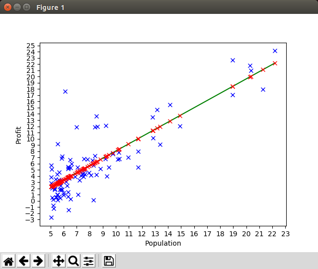

# Linear Regression - Coursera ML Exercise 1 Using TensorFlow

## Introduction

This is the ex1a in the [Machine Learning](https://www.coursera.org/learn/machine-learning) course provided in [Coursera](https://www.coursera.org). I did in winter 2016/2017. 

I have divided the actual exercise 1 into smaller parts (a,b...) in the order the parts of the original exercise was described in the PDF instruction.

## Exercise 1a

### Introduction

In the original exercise we implemented a simple linear regression model of one variable to predict profits for a food truck related to the population of the cities (the data should be interpreted x1000). 

The program has capability to plot the data using matplotlib.pyplot library. I took a screenshot of this plot which shows the relation between the population of the city and the profits using the data provided.


You can create the graphics running the program as:

```bash
./run-ex1a.sh data/ex1a-profit-population.csv ml_course_ex1a.ini true
```

In the data directory you can find the data file used in this exercise. The 0th column provides X = population, the 1st column provides y = profit.

This is linear regression of one variable (X) related to y, i.e. y = f(X). 

### Implementation

I modularize every exercise to a Python class which makes IMHO the code a bit more readable. At the end of the file is the main entry point to the file. It basically just reads the command line arguments, instantiates the class and calls the run method. 

The run method first plots the original data and then starts the linear regression calculation using TensorFlow library (with some help of NumPy library). The function is rather long, but this is not meant to be production software, just my private exercise. 

The implementation should be rather self-descriptive if you have learned the basics of linear regression and some basics of TensorFlow and NumPy libraries. Once the basic stuff (bias, placeholders, variables...) are done the actual heavy lifting is done using TensorFlow's [GradientDescentOptimizer](https://www.tensorflow.org/api_docs/python/tf/train/GradientDescentOptimizer) function (in the Coursera course we had to implement the algorithm using primitive matrix calculation).

### Analysis

The analysis part of the exercise was pretty interesting since I had done the same exercise previously in the ML course using Octave. 

The following picture shows the convergance of the cost function (J in code, J seemed to be the name prof. Ng used for cost functions, I mostly follow the same terminology in my Python code, i.e. J is cost function, n is the number of features and m is the number of samples).


I added some logging to compare this exercises values to the original ex1a exercise I did earlier using Octave:

```bash
2018-01-23 10:54:43,383 - TF - INFO - Comparing to original ex1 predictions using populations 3.5, 7.0 and 20.0
2018-01-23 10:54:43,383 - TF - INFO - Population: 3.5, profits: our predicion: 0.490537 (original: 0.451977), delta: 0.04 (8.53%)
2018-01-23 10:54:43,383 - TF - INFO - Population: 7.0, profits: our predicion: 4.551895 (original: 4.534245), delta: 0.02 (0.39%)
2018-01-23 10:54:43,383 - TF - INFO - Population: 20.0, profits: our predicion: 19.636938 (original: 19.696956), delta: -0.06 (-0.30%)
2018-01-23 10:54:43,384 - TF - INFO - Final trained weights: -3.5708 (original: -3.6303), 1.1604 (original: 1.1664)
2018-01-23 10:54:43,385 - TF - INFO - Convergance: J[1]: 6.7397 (original: 6.7372), J[1500]: 4.4866 (original: 4.4834)
```

So, there is some delta between the TensorFlow version predictions and original ex1 predictions done using Octave. First I was wondering whether there was some issue with the convergance, but when I compared the convergance values (the first and last cost function values between the TensorFlow version and Octave version) I realized that they are practically the same. Maybe I analyze this later on but let's now continue to the next exercise.

The original ex1 exercise plots the regression line to the diagram. I experimented with numpy and matplotlib to do this. I created the regression line (green) to the diagram and also calculated the predicted profit for each population value and plotted the predicted profits using red crosses (original values are in blue crosses). So, the red crosses basically describe how the population values are projected to the green regression line.




