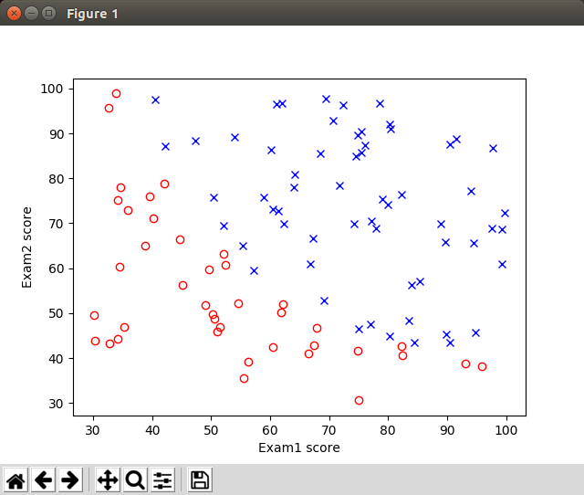

# Logistic Regression - Coursera ML Exercise 2 Using TensorFlow

## Introduction

This is the ex2 in the [Machine Learning](https://www.coursera.org/learn/machine-learning) course provided in [Coursera](https://www.coursera.org). I did in winter 2016/2017. 

I have divided the actual exercise 2 into smaller parts (a,b...) in the order the parts of the original exercise was described in the PDF instruction.

## Exercise 2a

### Introduction

In the original exercise we implemented a simple logistic regression model to predict whether an applicant gets admitted into a university based on the results of two exams.

As in the previous ML Coursera course exercise I plot the data in the beginning of the program to visualize the students who passed admittance (blue crosses) vs. those who didn't pass (red circles) regarding how they did in exam1 and exam2. This was once again an interesting exercise using numpy to create the boolean arrays regarding the admittance value (0 or 1) and then to create two sets of arrays exam1 and exam2 using the boolean arrays as filters. 



You can create the graphics running the program as:

```bash
./run-ex2a.sh data/ex2a-university-exam-results.csv ml_course_ex2a.ini true
```


