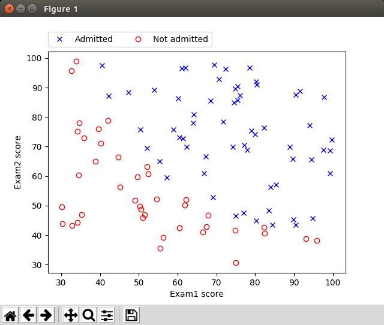
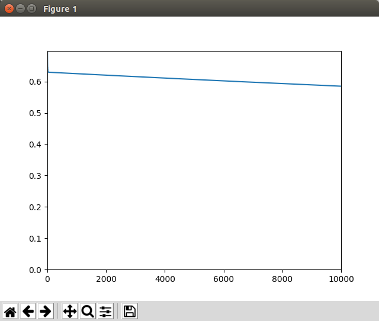
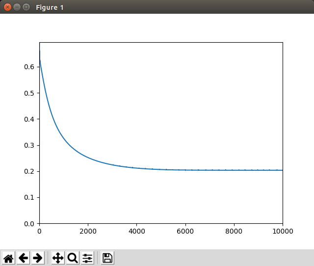
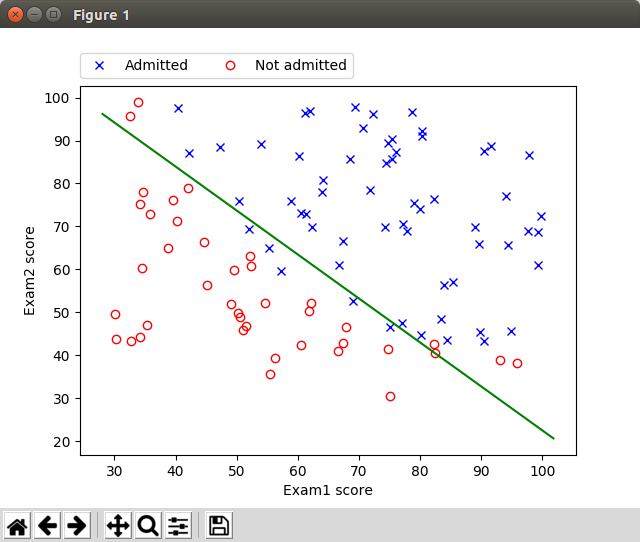
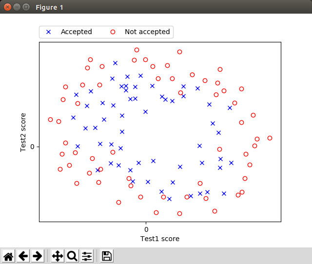

# Logistic Regression - Coursera ML Exercise 2 Using TensorFlow

## Introduction

This is the ex2 in the [Machine Learning](https://www.coursera.org/learn/machine-learning) course provided in [Coursera](https://www.coursera.org). I did in winter 2016/2017. 

I have divided the actual exercise 2 into smaller parts (a,b...) in the order the parts of the original exercise was described in the PDF instruction.

## Exercise 2a

### Introduction

In the original exercise we implemented a simple logistic regression model to predict whether an applicant gets admitted into a university based on the results of two exams.

As in the previous ML Coursera course exercise I plot the data in the beginning of the program to visualize the students who passed admittance (blue crosses) vs. those who didn't pass (red circles) regarding how they did in exam1 and exam2. This was once again an interesting exercise using numpy to create the boolean arrays regarding the admittance value (0 or 1) and then to create two sets of arrays exam1 and exam2 using the boolean arrays as filters. 



You can create the graphics running the program as:

```bash
./run-ex2a.sh data/ex2a-university-exam-results.csv ml_course_ex2a.ini true
```

So, as one can see you had to make pretty well in both exams to get admitted to the university. If you got excellent scores in one of the exam but did poorly in the other one your chances for getting admitted is not good.


### Implementation

I did the exercise pretty much the same way as the original exercise, except I implemented the logistic regression initial cost function twice: the first implementation is exactly the same plain cost formula as in the original Octave exercise, the second implementation uses TensorFlow [sigmoid_cross_entropy_with_logits](https://www.tensorflow.org/api_docs/python/tf/nn/sigmoid_cross_entropy_with_logits) library function. The reason for this was that I wanted to compare the two ways to implement logistic regression using TensorFlow. 


### Analysis

#### Initial Costs - Plain Cost Function Vs Sigmoid Cross Entropy with Logits

Both methods gave exactly the same results and the results were identical related to the origincal Octave exercise:

```bash
2018-02-24 19:27:42,998 - TF - DEBUG - ENTER run_logistic_regression_plain_initial_cost
...
2018-02-24 19:27:43,073 - TF - DEBUG - Comparing cost with the original cost of the Coursera exercise:
2018-02-24 19:27:43,073 - TF - DEBUG - J_value: 0.693147, original cost: 0.693147, delta: 0.000000 (0.0000%)
2018-02-24 19:27:43,074 - TF - DEBUG - EXIT run_logistic_regression_plain_initial_cost
2018-02-24 19:27:43,074 - TF - DEBUG - ENTER run_logistic_regression_sigmoid_cross_entropy_initial_cost
...
2018-02-24 19:27:43,121 - TF - DEBUG - Comparing cost with the original cost of the Coursera exercise:
2018-02-24 19:27:43,121 - TF - DEBUG - J_value: 0.693147, original cost: 0.693147, delta: 0.000000 (0.0001%)
2018-02-24 19:27:43,121 - TF - DEBUG - EXIT run_logistic_regression_sigmoid_cross_entropy_initial_cost

```
The initial costs are the same, so we are happy.

#### Training the Model

I had some difficulties in this part. I first started using [GradientDescentOptimizer](https://www.tensorflow.org/api_docs/python/tf/train/GradientDescentOptimizer) as with previous Linear Regression (ex1) exercise. I tried various parameters but I just couldn't make the model to converge using this optimizer (probably because it doesn't fit in this kind of logistic regression or I just didn't know how to tune it). Below you can see one of the convergances when using GradientDescentOptimizer with iterations=10.000 and alpha=0.001.

.


I googled other choices and found out that people often use another optimizer, [AdamOptimizer](https://www.tensorflow.org/api_docs/python/tf/train/AdamOptimizer) with Logistic regression because AdamOptimizer uses "moving averages of the parameters". Using AdamOptimizer with parameters: iterations=10.000 and alpha=0.01 I finally got the cost function to converge to the same value as in the original Octave exercise ex2:

.

If you have done the original Octave Machine Learning exercise you remember that in that exercise ex2 we didn't train the model manually (as in ex1) but we used Octave library function [fminunc](https://www.gnu.org/software/octave/doc/v4.0.0/Minimizers.html). We passed MaxIter=400 as optimization parameter to fminunc. As you can see in the Adam optimizer convergance graph the cost function is not even near to settle down to final converged value when iterations=400 (but starts to settle down in some value iterations=5000). I let the training to run 10.000 iterations and finally I got the same values as in the original Octave ex2 exercise:

```bash
2018-02-27 20:36:06,516 - TF - DEBUG - Comparing cost with the original cost of the Coursera exercise after 10000 iterations:
2018-02-27 20:36:06,516 - TF - DEBUG - J_value: 0.203498, original cost found by fminunc: 0.203498, delta: -0.000000 (-0.0001%)
2018-02-27 20:36:06,518 - TF - INFO - Final trained weights: -25.1447 (original: -25.1613), 0.2061 (original: 0.2062), 0.2013 (original: 0.2015)
2018-02-27 20:36:06,521 - TF - INFO - Comparing to original ex2a predictions using values: exam1 = 45.0 and exam2 = 85.0
2018-02-27 20:36:06,521 - TF - INFO - Our prediction: 0.77617 (original: 0.77629), delta: -0.00012 (-0.01593%)
```

So, I finally managed to create the similar model using TensorFlow as we created earlier using plain matrix calculations and fminunc with Octave in Machine learning Coursera course.


And finally I drew the data values of exam1 and exam2 with the decision boundary using green color as given by the trained model:


.

So, if we use this model to predict the admission of the candidates by their exam1 and exam2 values the decision boundary tells that value pairs (exam1,exam2) above the green line will be admitted and other pairs will not be admitted.


## Exercise 2b

### Introduction

In the original exercise we implemented a logistic regression model to predict whether a microchip would pass quality assurance based on two tests, test1 and test2. 

Let's first plot the data using the matplotlib library that we have been learning while doing these machine learning exercises.



You can create the graphics running the program as:

```bash
./run-ex2b.sh data/ex2b-microchip-test-results.csv ml_course_ex2b.ini true
```

This exercise is interesting since as one can see from the graphics there obviously is no linear decision boundary. To pass the quality assurance the microchip had to get pretty consistent near zero results in both tests 1 and 2. So we can guess that the decision boundary has to be something that resembles more a circle or an ellipse than a line as in exercise ex2a.


### Implementation

Because a straight line would not model the given test results, in the original Coursera exercise ex2b we had to make so called feature mapping. Feature mapping is a phase of machine learning data preparation when you map your original data variables to new synthetic data variables which will provide non-linear model, e.g. (x1, x2) => (x1, x2, X1^2, X2^2, X1*X2,...). 

In the original Coursera exercise ex2b we mapped (x1, x2) to 27 new variables + 1 bias, altogether 28 variables (bias first): (1, x1, x2, x1^2, x1*x2, x2^2, x1^3, x1^2*x2, ..., x1*x2^5, x2^6). Well, let's print all 28 variables:

```python
degree = 6
variables = "1, "
for i in range(1, degree+1):
    for j in range (0, i+1):
        buf = "(x1^" + str(i-j) + ") * (x2^" + str(j) + "), "
        variables = variables + buf
print(variables)
```

(removed the last comma manually) =>

```bash
1, (x1^1) * (x2^0), (x1^0) * (x2^1), (x1^2) * (x2^0), (x1^1) * (x2^1), (x1^0) * (x2^2), (x1^3) * (x2^0), (x1^2) * (x2^1), (x1^1) * (x2^2), (x1^0) * (x2^3), (x1^4) * (x2^0), (x1^3) * (x2^1), (x1^2) * (x2^2), (x1^1) * (x2^3), (x1^0) * (x2^4), (x1^5) * (x2^0), (x1^4) * (x2^1), (x1^3) * (x2^2), (x1^2) * (x2^3), (x1^1) * (x2^4), (x1^0) * (x2^5), (x1^6) * (x2^0), (x1^5) * (x2^1), (x1^4) * (x2^2), (x1^3) * (x2^3), (x1^2) * (x2^4), (x1^1) * (x2^5), (x1^0) * (x2^6)
```


### Analysis

TODO
