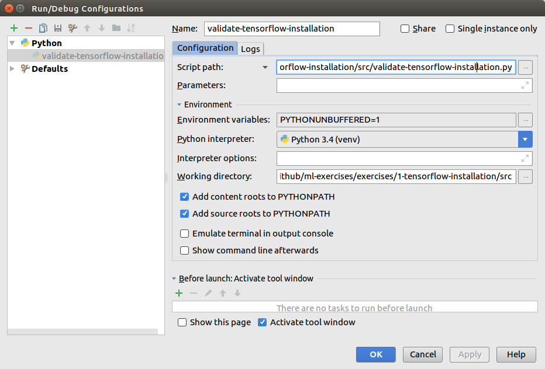

# Instructions to Use PyCharm with My Machine Learning Exercises

## Introduction

[PyCharm](https://www.jetbrains.com/pycharm/) is my favorite Python IDE. I occasionally use also [Emacs](https://www.gnu.org/software/emacs/) as a jack-of-all-trades editor when I want quickly to create a short Python script or fix some issue. But PyCharm is superior for anything else than occasional quick Python coding. PyCharm provides excellent editor and running environment (and debugger). So, I strongly recommend PyCharm for Python coding.

## Quick PyCharm Instructions

These are quick PyCharm instructions to be used with my ML exercises for Python.

1. Creating project with existing sources: https://www.jetbrains.com/help/pycharm/importing-project-from-existing-source-code.html 
2. Using existing virtualenv with the project: https://www.jetbrains.com/help/pycharm-edu/adding-existing-virtual-environment.html

I.e. If you want to use PyCharm for hacking, create first a project using existing sources, and then configure project to use existing virtualenv you created according to instructions found in file tensor-flow-installation.md.

I have added a couple of PyCharm screenshots as examples.

### PyCharm Virtual Environment configuration

This screenshot shows my virtual environment configuration I'm using in every TensorFlow exercise in this repo.
 

### PyCharm Run Configuration

This screenshot shows the run configuration of the project I created for running exercises/1-tensorflow-installation/src/validate-tensorflow-installation.py.
 

### PyCharm Running Validate Script

This screenshot shows the running exercises/1-tensorflow-installation/src/validate-tensorflow-installation.py.
 

So, if you finally saw the program output as in this screenshot you should be good to go with PyCharm/venv/TensorFlow installation/configuration for my ML exercises using Python.
